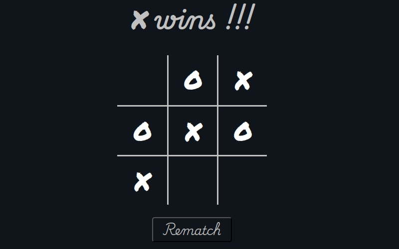

# Tic-Tac-Toe-2.0

Imagine a world where tic-tac-toe isn't just a mindless draw between seasoned players. Introducing the all-new, re-imagined version of this classic game! 

In this exciting twist, only your last three moves are recorded. That's right, you can only have a maximum of three Xs or Os on the board at any time.

This dynamic change ensures that every game is filled with strategic depth, unexpected turns, and endless fun. No more predictable draws—every match is a thrilling challenge!

Experience the evolution of tic-tac-toe and put your skills to the test. Ready to play? Dive into the action now at [this live site](https://faisals-ttt.netlify.app/).
